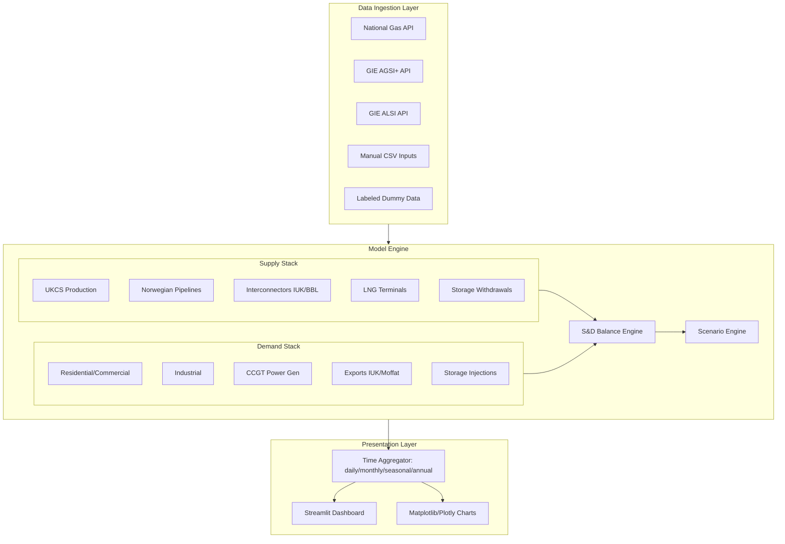

# NBP Gas Supply & Demand Stack Model

## How to Run

```bash
# 1. Install dependencies (first time only)
pip install -r requirements.txt

# 2. Launch the dashboard
python -m streamlit run src/dashboard/app.py --server.headless true
```

This opens the dashboard at **http://localhost:8501**. Everything works immediately using dummy data — no API keys required. Press `Ctrl+C` in the terminal to stop.

To connect live data sources, add API keys in `config/settings.yaml` or drop CSVs into `data/manual/` (see the **Connecting Live Data** section in `README.md`).

---

## Architecture Overview

A modular Python application structured around three layers: **data ingestion**, **model engine** (supply stack, demand stack, balance), and **presentation** (aggregation + Streamlit dashboard).



## Project Structure

```
NBP S&D Stacks/
├── requirements.txt
├── README.md
├── config/
│   └── settings.yaml              # Global config (units, date ranges, API keys)
├── data/
│   ├── raw/                       # Raw downloaded / API data
│   ├── processed/                 # Cleaned & normalized data
│   └── manual/                    # Manual input CSV templates
│       ├── ukcs_production.csv
│       ├── industrial_demand.csv
│       └── ...
├── src/
│   ├── __init__.py
│   ├── config.py                  # Config loader (YAML -> Python)
│   ├── data/
│   │   ├── __init__.py
│   │   ├── loaders.py             # Unified data loading interface
│   │   ├── national_gas.py        # National Gas Data Portal client
│   │   ├── gie_api.py             # GIE AGSI+ / ALSI client
│   │   ├── manual_input.py        # CSV template reader
│   │   └── dummy_data.py          # Clearly-labeled dummy data generator
│   ├── supply/
│   │   ├── __init__.py
│   │   ├── ukcs.py
│   │   ├── norway.py
│   │   ├── interconnectors.py
│   │   ├── lng.py
│   │   ├── storage_withdrawal.py
│   │   └── supply_stack.py        # Aggregates all supply components
│   ├── demand/
│   │   ├── __init__.py
│   │   ├── residential.py
│   │   ├── industrial.py
│   │   ├── power_gen.py
│   │   ├── exports.py
│   │   ├── storage_injection.py
│   │   └── demand_stack.py        # Aggregates all demand components
│   ├── balance/
│   │   ├── __init__.py
│   │   └── balance_engine.py      # S&D balance, linepack change
│   ├── scenarios/
│   │   ├── __init__.py
│   │   └── scenario_engine.py     # What-if adjustments
│   ├── aggregation/
│   │   ├── __init__.py
│   │   └── time_aggregator.py     # Daily -> Monthly -> Seasonal -> Annual
│   └── dashboard/
│       ├── __init__.py
│       └── app.py                 # Streamlit dashboard
├── notebooks/
│   └── exploration.ipynb
└── tests/
    ├── test_supply.py
    └── test_demand.py
```

## Supply Stack Components

Each component is a Python class inheriting from a `StackComponent` base class, returning a pandas DataFrame with columns: `date`, `volume_mcm` (million cubic meters/day), `source`, `data_quality` (API / manual / dummy).

| Component | Data Source | Notes |
|---|---|---|
| **UKCS Production** | MANUAL INPUT - NSTA publishes monthly; no free real-time API. User downloads from [NSTA Production Data](https://www.nstauthority.co.uk/data-centre/). | Label: manual input required |
| **Norwegian Pipelines** | API - [Gassco Transparency](https://www.gassco.no/en/our-activities/transparency/) provides daily nominated/actual flows for Langeled and Vesterled. | Will attempt scrape/API; fallback to manual. |
| **IUK Interconnector** | API - [National Gas Data Portal](https://data.nationalgas.com/) publishes daily physical flows at Bacton. | Free API, daily granularity |
| **BBL Pipeline** | API - National Gas Data Portal, same as above. | Free API, daily granularity |
| **LNG Terminals** | API - [GIE ALSI](https://alsi.gie.eu/) provides daily send-out from South Hook, Dragon, Isle of Grain. Free API with registration. | Free API, registration needed |
| **Storage Withdrawals** | API - [GIE AGSI+](https://agsi.gie.eu/) provides daily UK storage data (inventory, injection, withdrawal). | Free API, registration needed |

## Demand Stack Components

| Component | Data Source | Notes |
|---|---|---|
| **Residential/Commercial** | API - National Gas publishes daily actual demand (LDZ demand). Temperature-driven via Composite Weather Variable (CWV). | Free API. For forecasting: CWV regression model using Met Office data. |
| **Industrial** | MANUAL INPUT - Large daily metered (LDM) and daily metered (DM) demand from National Gas. Some available via API, some manual. | Partially API, partially manual |
| **CCGT Power Gen** | API - [Elexon/BMRS](https://www.bmreports.com/) provides half-hourly CCGT generation. Convert MW to mcm/d using heat rate. | Free API. Spark-spread sensitivity for forecasting. |
| **Exports (IUK)** | API - National Gas Data Portal, same flow data as supply but reversed direction. | Bidirectional - net flow determines if supply or demand |
| **Exports (Moffat/Ireland)** | API - National Gas Data Portal. | Dedicated pipeline, always export |
| **Storage Injections** | API - GIE AGSI+, same source as withdrawals. | Net storage = injection - withdrawal |

## Key Design Decisions

### Units

- Base unit: **mcm/d** (million cubic meters per day) -- standard for UK gas reporting.
- Built-in conversion to **GWh/d** (1 mcm approx 11.16 GWh at standard CV) and **therms**.
- CV (calorific value) configurable in `settings.yaml`.

### Multi-Horizon Aggregation

A `TimeAggregator` class handles rollup from the base daily granularity:

- **Daily**: raw model output
- **Monthly**: mean daily rate per month + total volume
- **Seasonal**: Gas Year quarters (Q1: Oct-Dec, Q2: Jan-Mar, Q3: Apr-Jun, Q4: Jul-Sep)
- **Annual**: Gas Year (Oct-Sep) totals

All stored in a single DataFrame with a `granularity` column, so the dashboard can filter by horizon.

### Scenario Engine

Pre-built scenario templates:

- **Cold snap**: Increase residential demand via CWV shock, increase storage withdrawals
- **LNG diversion**: Reduce LNG send-out by X%, model price impact
- **Norwegian outage**: Zero specific pipeline flow for N days
- **Interconnector reversal**: Flip IUK from import to export
- Custom: user-defined multipliers on any component

### Dashboard (Streamlit)

Pages:

1. **Overview**: Stacked area chart of supply vs demand, balance bar, current status
2. **Supply Drill-down**: Individual component timeseries, merit-order view
3. **Demand Drill-down**: Sector breakdown, temperature sensitivity
4. **Scenarios**: Side-by-side comparison of base case vs scenarios
5. **Data Quality**: Table showing which components use API / manual / dummy data

### Data Quality Labeling

Every data point carries a `data_quality` flag:

- `"api"` -- pulled from a live/historical API
- `"manual"` -- user-provided CSV
- `"dummy"` -- synthetic data with documented justification
- `"forecast"` -- model-generated forward projection

Dummy data justifications are stored in `src/data/dummy_data.py` with inline documentation explaining assumptions (e.g., "UKCS seasonal profile based on 5-year historical average shape from NSTA").

## Implementation Order

Build bottom-up: data layer first, then individual components, then aggregation, then dashboard.

### Phase 1: Foundation

- Project scaffolding, config system, base classes (`StackComponent`, `TimeAggregator`)
- Dummy data generators with clear labeling for all components
- Unit conversion utilities

### Phase 2: Supply Stack

- Implement each supply component class with dummy data
- Wire up available free APIs (National Gas, GIE ALSI, GIE AGSI+)
- CSV template readers for manual-input components
- `SupplyStack` aggregator

### Phase 3: Demand Stack

- Implement each demand component class with dummy data
- Wire up APIs (National Gas LDZ demand, Elexon CCGT)
- CWV-based residential demand model for forecasting
- `DemandStack` aggregator

### Phase 4: Balance & Scenarios

- Balance engine (supply - demand = surplus/deficit + linepack change)
- Scenario engine with pre-built templates
- Forecasting extensions (simple trend + seasonal for each component)

### Phase 5: Dashboard & Polish

- Streamlit dashboard with all 5 pages
- Time horizon selector (daily / monthly / seasonal / annual)
- Scenario comparison views
- Data quality indicators throughout
- README with setup instructions
